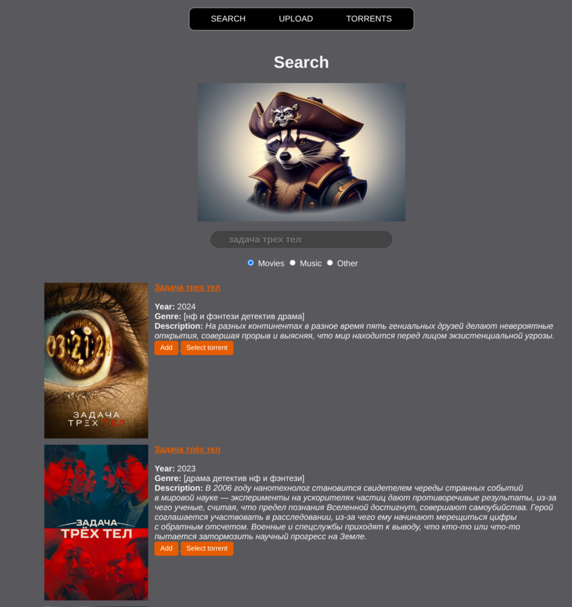
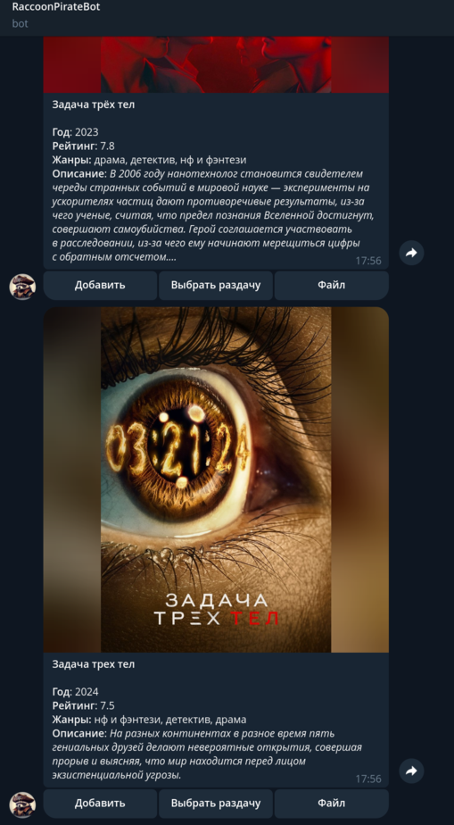

# RaccoonPirate

[](https://github.com/racoon-devel/RaccoonPirate/actions/workflows/release.yml)


Application for consuming media content from torrent trackers on-the-fly.

## 🎓 How it works?

### Content Sources

The application consumes torrent-files or magnet links to peering networks for downloading sought-for content. They are can be provided by one of the following ways:

* discover via [API](https://github.com/RacoonMediaServer/rms-media-discovery/blob/master/api/discovery.yml) by [Racoon Media Server remote backend service](https://github.com/RacoonMediaServer/rms-remote). It supports:
    * [RuTracker.org](https://rutracker.org/);
    * [RUTOR](https://rutor.info/);
    * [AniDub](https://tr.anidub.com/).
* manually add via user interface.

### Delivery Method

The application mounts a directory as Fuse file system and manages I/O operations for the directory. After torrent registration - content directory layout maps to the cache directory. User can use any media player for play the content. Data will be downloading on-the-fly. Data chunk rotation is supported by set data storage limit in config file. 

## 📱 User Interface

There are a few frontends available:

* Web UI;
* Telegram Bot integration;
* cli (_hasn't implmented yet_).

Frontends provide:
* interactive search of various content type;
* upload .torrent files directly;
* manage added items.

### Web



### Telegram

[RaccoonPirateBot](https://t.me/RaccoonPirateBot) is running on the backend side and be able to serve multiple clients. **Security code for link your telegram account to the bot can be obtained from a RaccoonPirate log**. Example of the message:

```
2025/11/10 23:49:05  info Telegram connection info: 
**************************************************
* Bot: https://t.me/RaccoonPirateBot             *
* Code: _-------_                                *
**************************************************
```




## 💻 Supported Platforms

* Linux;
* Batocera on Raspberry PI (retro-gaming Linux distro, RaccoonPirate supports integration).

## 👨‍💻 Use Case Scenarios

* Watching any discoverable content on the PC/MiniPC by any media player;
* Install the application to home server and stream data over network for consuming from various devices (e.g. DLNA servers).  

## 🔗 Dependencies

* libfuse (v2.9.9)

## 🛠️ Build

```shell
make
```

### Cross build for Raspberry Pi

[Install and configure Docker daemon](https://docs.docker.com/engine/install/).

Select _target triplet_, which compatible with target Raspberry Pi device from [the table](https://github.com/tttapa/docker-arm-cross-toolchain?tab=readme-ov-file#download). Set the `TARGET_TRIPLET` variable and run `make rpi`. Example for Raspberry Pi 5:

```shell
TARGET_TRIPLET=aarch64-rpi3-linux-gnu make rpi
```

#### Build package for Batocera Linux

```shell
TARGET_TRIPLET=aarch64-rpi3-linux-gnu make batocera
```

Copy composed package to batocera and run:

```shell
pacman -U raccoon-pirate-1.0.0-1-aarch64.pkg.tar.zst
batocera-services enable raccoon_pirate
batocera-services start raccoon_pirate
```

## 🚀 Run

```shell
./raccoon-pirate -config /etc/raccoon-pirate/raccoon-pirate.yml
```

Config example & explanation could be found [here](configs/raccoon-pirate.yml). Symlinks hierarchy of content files will be stored to the configured folder (parameter `representation.directory` is responsible for that). 
